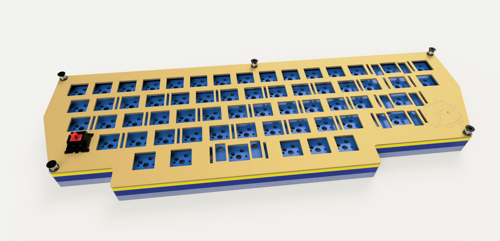

# Hedgehog

A 60ish keyboard with a new case design (TBA). This has been heavily inspired
by the layout of [Purple Owl](https://github.com/SonalPinto/purple-owl) but I
wanted a more programmer friendly right side with larger modifier keys. So I
changed some keys and also redesigned the PCB to use a more standard
QMK approach.

TL;DR: Pricing and surplus parts listed at the end!

## Status

- Plated ETA at 15/11, felt layer ETA 15/11, case parts also ordered with no
ETA. Pricing see below.
- PCBs have arrived and tested good.
- Found plate manufacturer, plates and weight will be brass laser cut. Plate
will have engraving. Cost listed below, comparably cheap for low amount of parts
and a strong reduction in cost with more parts expected.
- Sourcing part manufacturers for casing.
- Case design finished.
- Ordered PCBs for Daughterboard and Keyboard.
- PCB design done.

## Layout

The layout is somewhat odd. The aim was to have a good amount of modifiers
and still keep the interesting stagger and a trapezoidal shape. This lead to the
removal of the nav cluster, thus this is the initial lite version. I might create
another one with arrow cluster and going for a parallelogram shape. Final
layout ended up like this


## Assembly

Final assembly goes here, part details and programing see below.

#### PCB

PCBs have arrived and look quite cool. All features seem to work! Tested both FWs
and all buttons, LEDs and other features work as expected.
**TL;DR** *No need to solder any headers and ISP, out of the box PCBs accept
initial firmware using `qmk flash` over USB!* Thanks, ATMEL (I guess, but please
update your documentation!)


First thing I noticed is that I chose a 1.27mm spacing for ISP which I did not
have around, so I had to fetch some
headers. Soldering is quite annoying at that pitch but doable. Next up was an
adapter for my ISP programmer which again was for 2.54mm spacing. Again very
fiddly. Should've tested before to avoid some burnt fingers.
Finally, solder RST switch at the front, thats quite easy.

For an initial check if everything is hooked up run
```
> avrdude -c usbasp -p m32u4

avrdude: AVR device initialized and ready to accept instructions

Reading | ################################################## | 100% 0.00s

avrdude: Device signature = 0x1e9587 (probably m32u4)
```
seems good, check the fuses:
```
>  avrdude -c usbasp -p m32u4 -U lfuse:r:-:h -U hfuse:r:-:h -U efuse:r:-:h

avrdude: AVR device initialized and ready to accept instructions

Reading | ################################################## | 100% 0.00s

avrdude: Device signature = 0x1e9587 (probably m32u4)
avrdude: reading lfuse memory:

Reading | ################################################## | 100% 0.00s

avrdude: writing output file "<stdout>"
0x5e
avrdude: reading hfuse memory:

Reading | ################################################## | 100% 0.00s

avrdude: writing output file "<stdout>"
0x99
avrdude: reading efuse memory:

Reading | ################################################## | 100% 0.00s

avrdude: writing output file "<stdout>"
0xf3

avrdude done.  Thank you.
```
Perfect, nothing to change here. Mind that `JTAG` is on but that should not be
of an issue here. Go ahead and flash the firmware (just use production, which
includes a bootloader!)

```
avrdude -c usbasp -p m32u4 -U flash:w:11kbd_hedgehog_lite_default_production.hex

avrdude: AVR device initialized and ready to accept instructions

Reading | ################################################## | 100% 0.00s

avrdude: Device signature = 0x1e9587 (probably m32u4)
avrdude: NOTE: "flash" memory has been specified, an erase cycle will be performed
         To disable this feature, specify the -D option.
avrdude: erasing chip
avrdude: warning: cannot set sck period. please check for usbasp firmware update.
avrdude: reading input file "11kbd_hedgehog_lite_default_production.hex"
avrdude: input file 11kbd_hedgehog_lite_default_production.hex auto detected as Intel Hex
avrdude: writing flash (32768 bytes):

Writing | ################################################## | 100% 8.60s

avrdude: 32768 bytes of flash written
avrdude: verifying flash memory against 11kbd_hedgehog_lite_default_production.hex:
avrdude: input file 11kbd_hedgehog_lite_default_production.hex auto detected as Intel Hex

Reading | ################################################## | 100% 7.41s

avrdude: 32768 bytes of flash verified

avrdude done.  Thank you.
```
Perfect, you can test the PCB now and / or test the bootloader by flashing a
new firmware using QMK (after copying the folders or running from the repo)
```
qmk flash -kb 11kbd/hedgehog_lite -km default
```
All works! If you want to prevent changing the FW, just open the slide switch
and any reprogramming will be disabled.

#### Daughterboard

Daughterboards just work out of the box - nothing to add here. Building the
cables, however, is an issue. First, I tried to crimp them myself but even with the
smaller pliers I did not manage to have a good reproducible result. I then just
bought single sided cables and soldered the wires using two ends. Not pretty
but works, and if you look at some shop offers online, it does look to be an
often used workaround.

I did find a custom cable shop in CN which can produce the cables for around
0,40€ per cable but they start at 100pcs so this wasn't a good option here.
Maybe if some group buy will run at some point, I will follow this route. For
now, !no cables are available from my side!

#### Plate and Case

ToDo

## PCB Details

The PCB is a basic QMK capable **ATmega32U4** row-col setup, using 9 rows and
9 columns. The PCB was designed in KiCAD and the current design is somewhere
between WiP and ready for a prototype. Cool features include a good number of
underglow (15) LEDs and some flex cuts. Switch sockets are hotswap and layout
is a single fixed one, derived from ANSI. No stepped caps or any splits at this point.

The USB connection is a JST with support for *Unified Daughterboard* by **ai03**
which make the PCB able to move and flex and saves some space. Also, feel free
to adapt the case to place the USB wherever you want.


There are, compared to other PCBs out there, some smaller quirks and features
which are notable:
- The PCB uses a *M*-variant of the AtMega due to shortages and prices hikes of
the more common *A*-variant. Also, this one is a little more compact.
- The implemented *M*-variant has **no USB bootloader** flashed. Initially,
this has to be done (or not see above). Using a basic *ISP* programmer,
check the fuses and if needed set them to the QMK values (which are good for
external oscillator). Afterwards, USB flashing using *RST* over USB *should*
work (confirm that *HWB* switch is closed!). See assembly section for details!
- LED power supply is activated with a solder jumper. This reduces current
during initial flash and allows to leave LEDs disabled in non-translucent cases.
- HWB pin is connected with a switch. So by either not soldering this in or
setting to open position bootloader access and flashing can be preventing and
also reducing startup time / room for errors. A jumper exists to fully override
the switch.
- Reset switch is placed on bottom ("top" during use) layer below spacebar so
resetting can be done with case fully assembled.

The above should make it clear that **even with an assembled PCB** minimal
soldering is required for full functionality. I will only have one PCB side
assembled to save money - so when **using this procedure or leftover PCBs**.
I might offer the reset switch has to be placed and soldered afterwards to allow
bootloader flash.

## Case and Mount Details

Case will be designed for either laser cutting or printing / milling. Currently,
the case is layered for cutting so some cutouts aren't perfect but milling is
not feasible in prototyping and small batch. Current color design is frosted
bottom, blue mid, warm yellow felt and brass plate. Overall height will be 16.5mm
to plate surface. Feets are optional and might get added to tent the whole case.

Bottom and three rings (one acrylic, two blue, split not visible in render)
will be screwed from below. Plate will be screwed from top into preassembled
bottom.

Plate is designed to be aluminum or brass, and the plate mount is done via a
felt / cork dampening layer and springs. Plate logo is optional depending on
engraving capabilities of specific shops.

Initial CAD renders below showing top, spring mount in comparison with
switch size and the connector which is currently placed at the left side.




## Name
Because its autumn and that's the perfect time for them!

## Cost breakdown

Obviously, this is a prototype / small batch so pricing will a) comparable high
and b) differ in different locations. Also, due to my profession, I do have some
connection which make some of the steps easier. Cost is listed for an order
of (at least) five keyboards. Second to last column shows parts which are surplus
(contact me if you are interested!)

| **Part** | **Produced by / at** | **Price** | **# available** | **Remark** |
|----------|----------------------|-----------|-----------------|------------|
| Main PCB | JLCPCB assembled | 35€ | 3 | One side assembled, RST switch and jumpers need soldering, parts included. |
| Unified Daughterboard (with cable) | JLCPCB assembled | 10€ | 3 | PCB is 1.2mm for increased spacing! |
| Brass plate 1.5mm | Local shop | 35€ | 3 | Price includes engraved hedgehog and basic removal of burrs. Might glassbead blast it later for satin looks. |
| Brass weight 2mm | Local shop | 10€ | 3 | Only two millimeter due to material availability - will add some weight and looks! |
| Case lower frosted acrylic | Local shop | 25€ | none | No discount for multiple parts |
| Case mid colored acrylic | Local shop | 35€ | none | No discount for multiple parts |
| Felt damper | Local shop | 8€ | 3 |  |
