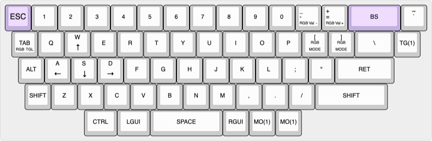
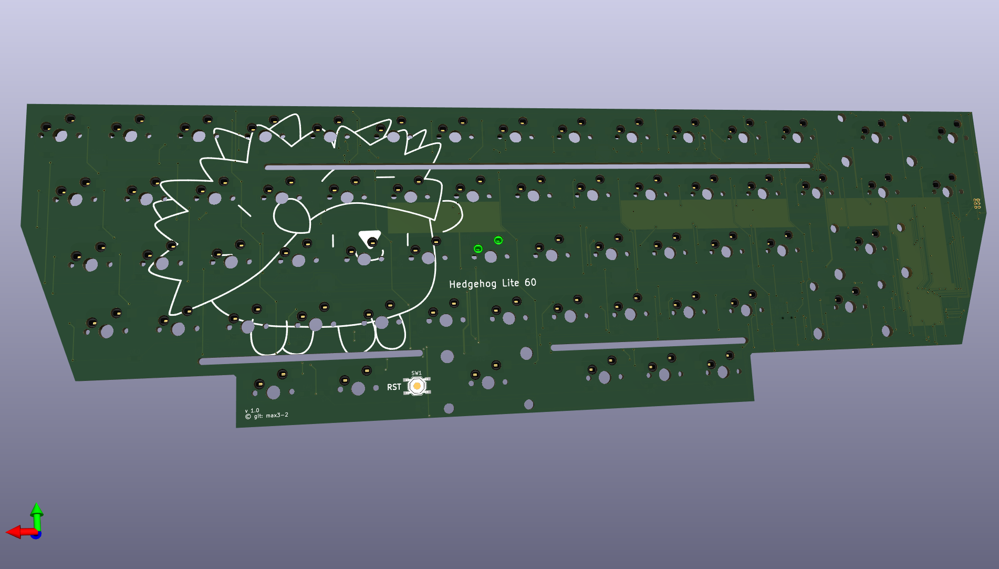
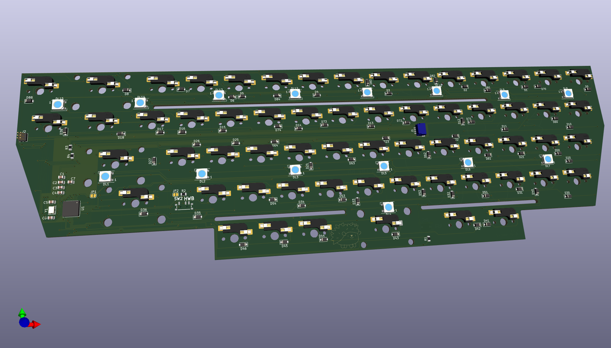

# Hedgehog

A 60ish keyboard with a new case design (TBA). This has been heavily inspired
by the layout of [Purple Owl](https://github.com/SonalPinto/purple-owl) but I
wanted a more programmer friendly right side with larger core keys. So I
changed some keys and also redesigned the PCB to use a more standard
QMK approach.

## Layout

The layout is somewhat odd. The aim was to have a good amount of modifiers
and still keep the interesting stagger and a trapezoidal shape. This lead to the
removal of the nav cluster, thus this is the initial lite version. I might create
another one with arrow cluster and going for a parallelogram shape. Final
layout ended up like this



## PCB

The PCB is a basic QMK capable **ATmega32U4** row-col setup, using 9 rows and 9 columns. The PCB was designed in KiCAD and the current design is somewhere between WiP and ready for a prototype. Cool features include a good number of underglow (15) LEDs and some flex cuts. Switch sockets are hotswap and layout is a single fixed one,
derived from ANSI. No stepped caps or any splits at this point.

The USB connection is a JST with support for *Unified Daughterboard* by **ai03**
which make the PCB able to move and flex and saves some space. Also, feel free to adapt the case to place the USB wherever you want.




There are, compared to other PCBs out there, some smaller quirks and features which are notable:
- The PCB uses a *M*-variant of the AtMega due to shortages and prices hikes of the more common *A*-variant. Also, this one is a little more compact.
- The implemented *M*-variant has **no USB bootloader** flashed. Initially, this has to be done. Using a basic *ISP* programmer, check the fuses and if needed set them to the QMK values (which are good for external oscillator):
        ```
        ToDo: Add information on fuse check and set
        ```
Afterwards, use the `atmel-dfu` bootloader (see QMK docs, again) and flash this to your PCB:
        ```
        ToDo: Add information on bootloader flashing
        ```
Afterwards, USB flashing using *RST* over USB *should* work (confirm that *HWB* switch is closed!)
- LED power supply is activated with a solder jumper. This reduces current during initial flash and allows to leave LEDs disabled in non-translucent cases.
- HWB pin is connected with a switch. So by either not soldering this in or setting to open position bootloader access and flashing can be preventing and also reducing startup time / room for errors. A jumper exists to fully override the switch.
- Reset switch is placed on bottom ("top" during use) layer below spacebar so resetting can be done with case fully assembled.

The above should make it clear that **even with an assembled PCB** minimal soldering is required for full functionality. I will only have one PCB side assembled to save money - so when **using this procedure or leftover PCBs** I might offer the reset switch has to be placed and soldered afterwards to allow bootloader flash.

## Case and Mount

Case will be designed for either laser cutting or printing / milling. Currently,
the case is layered for cutting so some cutouts aren't perfect but milling is
not feasible in prototyping and small batch. Current color design is frosted
bottom, blue mid, warm yellow felt and brass plate.

Bottom and three rings will be screwed from below. Plate will be screwed from
top into preassembled bottom.

Plate is designed to be aluminum or brass, and the plate mount is done via a
felt / cork dampening layer and springs. Plate logo is optional depending on
engraving capabilities of specific shops.

Initial CAD renders below showing top, spring mount in comparison with
switch size and the connector which is currently placed at the left side.


## Name
Because its autumn and that's the perfect time for them!
